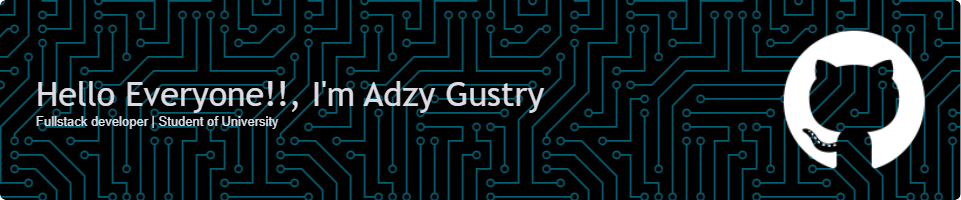

<!-- - 🔭 I'm currently Working [**Laravel**](https://laravel.com) Framework -->

## Hello Everyone!! I'm Adzy Gustry 👋

<!-- #### My Skills

#### My Sosmed | Connect With Me

 -->

<!-- #### My Github Stats
 -->
<!-- # 💫 About Me:
Hello Everyone!! I'm Adzy Gustry 👋 -->
<picture>
  <source media="(prefers-color-scheme: dark)" srcset="https://raw.githubusercontent.com/bangzyy/bangzyy/output/pacman-contribution-graph-dark.svg">
  <source media="(prefers-color-scheme: light)" srcset="https://raw.githubusercontent.com/bangzyy/bangzyy/output/pacman-contribution-graph.svg">
  
</picture>

###

###

## 🌐 Socials:
  

# 💻 Tech Stack:
               
# 📊 GitHub Stats:
 
 

## 🏆 GitHub Trophies

### 🔝 Top Contributed Repo

---

<!-- Proudly created with GPRM ( https://gprm.itsvg.in ) -->